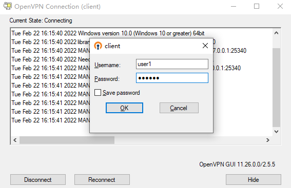
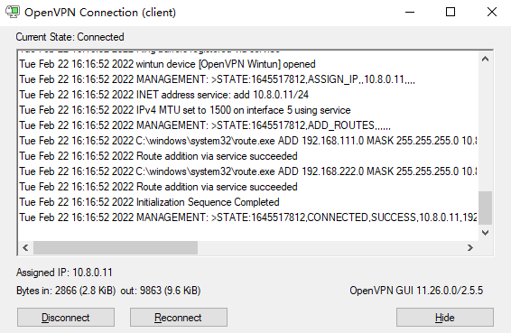

## Description
OpenVPN installation package, users can run OpenVPN service with only a small adjustment. </p>
So easy.

## Features
- Compiled based on [openvpn-2.5.5.tar.gz](https://swupdate.openvpn.org/community/releases/openvpn-2.5.5.tar.gz) source code, never changed any source code
- [Overview of changes in 2.5.5](https://github.com/OpenVPN/openvpn/blob/release/2.5/Changes.rst)
- Out of the box

## System support
Rocky Linux 8

## Install
Install the RPM package, you need the `python36`、`python3-cryptography` dependency package.
```shell
[root@rocky ~]# dnf install python36 python3-cryptography
[root@rocky ~]# rpm -ivh OpenVPN-2.5.5-1.el8.x86_64.rpm 
Verifying...                          ################################# [100%]
Preparing...                          ################################# [100%]
Updating / installing...
   1:OpenVPN-2.5.5-1.el8              ################################# [100%]
Generating a RSA private key
.............................+++++
......................................+++++
writing new private key to 'cert/ca.key'
-----
Generating a RSA private key
.......................+++++
....................+++++
writing new private key to 'cert/server.key'
-----
Using configuration from openssl.cnf
Check that the request matches the signature
Signature ok
The Subject's Distinguished Name is as follows
countryName           :PRINTABLE:'CN'
stateOrProvinceName   :ASN.1 12:'China'
localityName          :ASN.1 12:'China'
organizationName      :ASN.1 12:'OpenVPN CA'
commonName            :ASN.1 12:'OpenVPN CA'
Certificate is to be certified until Feb 20 15:03:38 2032 GMT (3650 days)

Write out database with 1 new entries
Data Base Updated
Generating DH parameters, 2048 bit long safe prime, generator 2
This is going to take a long time
.........................................+...........................
.........................................................++*++*++*++*

Create client configure file: '/etc/openvpn/cert/cert/client.ovpn'
```

## Usage
1. adjust route
```shell
[root@rocky ~]# vpnctl vi-conf
...
# 6. Route
# push "redirect-gateway def1 bypass-dhcp"
# push "dhcp-option DNS x.x.x.x"
push "route 192.168.111.0 255.255.255.0"
push "route 192.168.222.0 255.255.255.0"
...
```

2. create user password
```shell
[root@rocky ~]# vpnctl epass
Password: 
Retype Password: 
Ciphertext: gAAAAABiFP4ZEuEXSui53CCx2wdxAv3DVL42au9dVB0Akl3PcauDNm0y1qjcE_LXJxqE0FoktX9v9I0qIvlhnkgnbGAQJnGHlw==
```

3. create openvpn user
```shell
[root@rocky ~]# vpnctl vi-passwd
[user1]
epasswd = gAAAAABiFP4ZEuEXSui53CCx2wdxAv3DVL42au9dVB0Akl3PcauDNm0y1qjcE_LXJxqE0FoktX9v9I0qIvlhnkgnbGAQJnGHlw==
address = 10.8.0.11
netmask = 255.255.255.0
```

4. start openvpn server
```shell
[root@rocky ~]# vpnctl start
Starting OpenVPN (pid: 10329)   [ OK ]
```

5. adjust the client configuration file
```shell
[root@rocky ~]# vi /etc/openvpn/cert/cert/client.ovpn
...
remote x.x.x.x 443
...
```

6. install the openvpn client and import the configuration file, connection </p>





